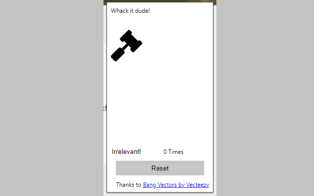
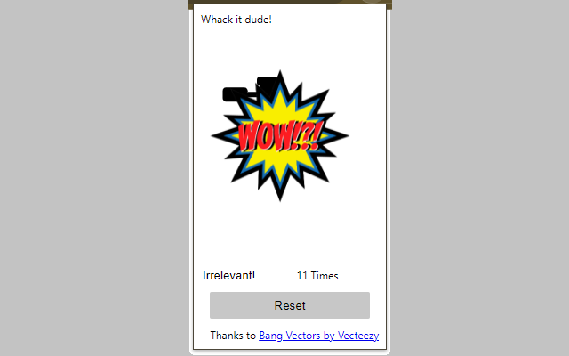
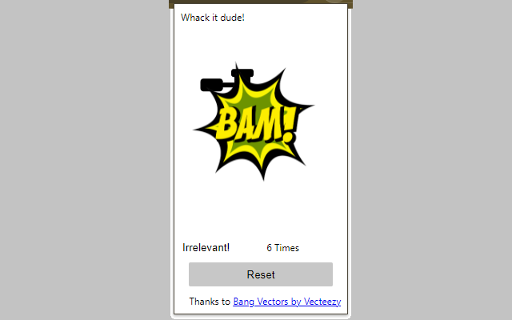
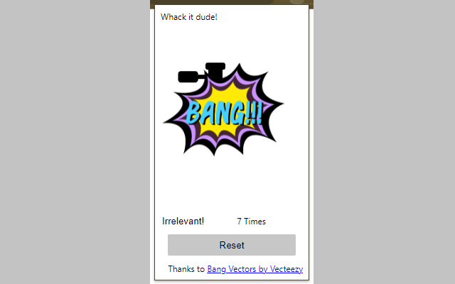

# whack-a-word
A funny Chrome Extension to whack a word, with a counter.

# Download the Chrome Extension

* Download the extension from the following link:
https://chromewebstore.google.com/detail/whack-a-word/fhhiilhgmgildcnammeiclbhiobmkijb

* Set a word and whack it to see interesting effects!

* Ever wondered how to count the word "Irrelevant!" on a stream?
Whack them and count them with this funny extension.

# Screenshots

